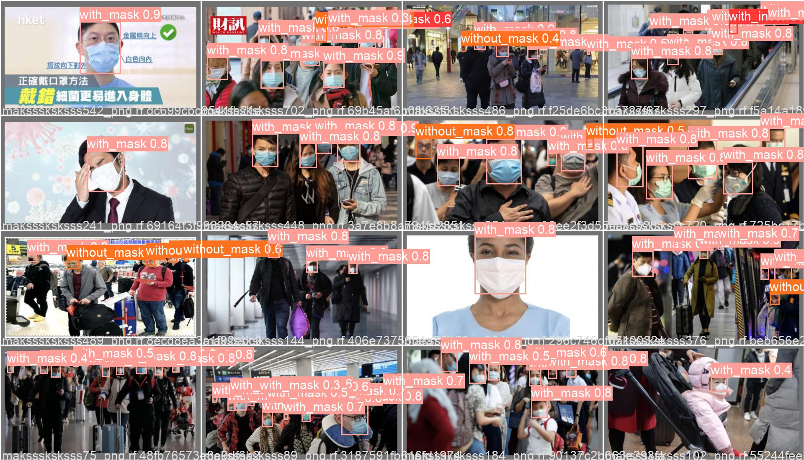

# SuperMaskDetector
Projet pour detecter si un masque est bien mis ou non

#Pour démarer le projet
-Il faut installer yoloV5 en faisant "git clone https://github.com/ultralytics/yolov5.git"
-Installer les requirement de yoloV5
-**Uniquement pour PycocoTool** Déplacer le fichier val.py de To_move_in_YoloV5/ vers yoloV5/ et écraser celui de yolo
-Pour convertir le datasetKaggle(voc) vers coco j'ai utilisé le script, j'ai fourni le .json pour utiliser pycocotool dessus directement. voc2coco.py https://github.com/yukkyo/voc2coco

#Inférence sur webcam
0. **Uniquement pour avoir les FPS** Déplacer le fichier detect.py de To_move_in_YoloV5/ vers yoloV5/ et écraser celui de yolo
1. Se placer dans yoloV5/
2. Executer "python detect.py --source 0 --weights ../Reseaux/ReseauN21yoloV5s.pt"
4. un dossier est crée dans runs/detect

#Validation avec le dataset de kaggle et pycocotool
1. Se placer dans yoloV5/
2. Executer "python val.py --data ../DataSet/KaggleYolo/data.yaml --weights ../Reseaux/ReseauN21yoloV5s.pt --save-json"
3. Un dossier est crée dans runs/val
4. Il faut utiliser pycocotool à part pour comparer les 2 jsons

#Entrainement
1. Le dataset utilisé est une fusion de celui de cette année 2021-2022 (https://github.com/jolignier/face-mask-dataset-ilc-2021)  et celui de l'année dernière
2. Pour entrainer nous utilisons "python train.py --img 640 --batch 20 --epochs 15 --data datadudataset.yaml --weights yolov5s.pt --hyp ../DataSet/hypV7.yaml"
3. Un dossier est crée dans runs/train

Crée par Peter BACHOUR et Romain ANQUETIN
